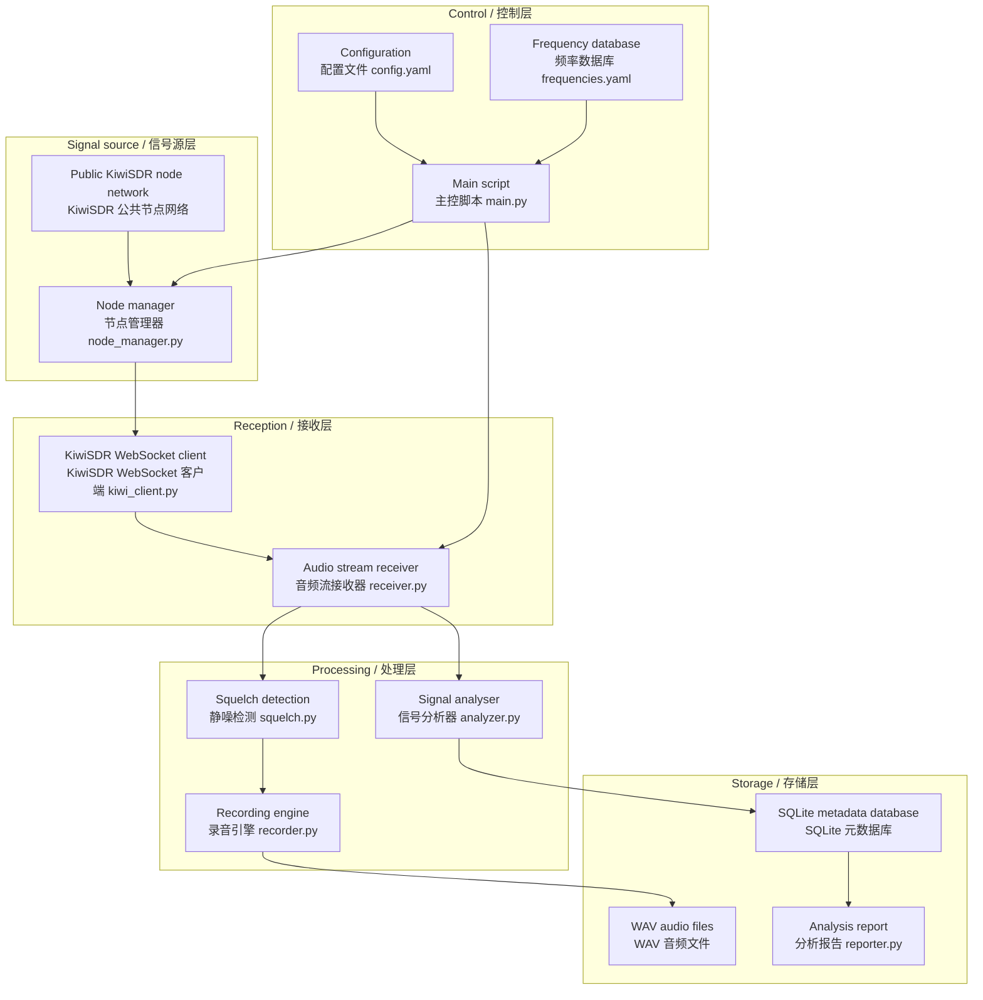

# Implementation plan — military radio reception and metadata analysis / 军事无线电信号接收与元数据分析系统

> **Historical record: this is the original design plan, written before the first line of code.**
> It is kept for the architecture and the reasoning behind it, not as current documentation — the
> open questions below were answered long ago, and several modules have since been split or
> replaced. For how the system works today read [USAGE.md](USAGE.md); for what changed and why
> read [CHANGELOG.md](CHANGELOG.md).
>
> **这是最初的设计方案，写在写第一行代码之前**，保留下来是为了架构和当时的取舍理由，
> 不是当前文档 —— 下面的待定问题早就有答案了，有几个模块后来也被拆分或替换。
> 系统现在是怎么运作的看 [USAGE.md](USAGE.md)，改了什么、为什么改看 [CHANGELOG.md](CHANGELOG.md)。
>
> **Bilingual document: English first, Chinese second. / 本文为中英双语，英文在前、中文在后。**

Build a local Python system on top of the worldwide network of open KiwiSDR nodes that connects to
public SDR receivers automatically, monitors known military HF bands, records audio, and performs
signal metadata analysis and visualisation.

基于全球开源 KiwiSDR 节点网络，构建一套本地 Python 脚本系统，自动连接公共 SDR 接收器，
监听已知军事 HF 频段，录制音频，并进行信号元数据分析与可视化。

> [!NOTE]
> This project is for lawful radio monitoring as a hobby. Receiving publicly broadcast radio
> signals is legal in most countries and regions. We monitor only publicly known military
> frequencies, and there is no decryption or any other unlawful activity involved.
>
> 本项目仅用于合法的无线电监听爱好。接收公开广播的无线电信号在大多数国家/地区是合法的。
> 我们只监听公开已知的军事频率，不涉及解密或任何非法行为。

## User review required / 需要用户确认

> [!IMPORTANT]
> **How to connect to KiwiSDR nodes.** KiwiSDR has no official public node-list API, so the plan is:
> 1. Ship a curated list of public KiwiSDR nodes (with location, frequency range and so on)
> 2. Let users add and edit nodes themselves
> 3. Receive the audio stream over a direct WebSocket connection to the node
>
> If you have particular KiwiSDR nodes or regions you want to monitor, say so.
>
> **KiwiSDR 节点连接方式**：由于 KiwiSDR 没有官方公开的节点列表 API，我计划采取以下方案：
> 1. 内置一个精心整理的公共 KiwiSDR 节点列表（包含地理位置、频率范围等）
> 2. 提供用户手动添加/编辑节点的能力
> 3. 使用 WebSocket 直连 KiwiSDR 节点进行音频流接收
>
> 如果你有特定想监听的 KiwiSDR 节点或区域偏好，请告知。

> [!WARNING]
> **About the `kiwiclient` library.** The standard approach is to use `jks-prv/kiwiclient`, which
> requires a `git clone`. To reduce external dependencies and stay in control, the plan is to
> **write a lightweight KiwiSDR WebSocket client** containing only what we need (connect, tune,
> receive audio), keeping the code fully self-contained.
>
> **关于 `kiwiclient` 库**：标准方案是使用 `jks-prv/kiwiclient` 库（需要 `git clone`）。
> 为了减少外部依赖、提高可控性，我计划**自行实现一个轻量级的 KiwiSDR WebSocket 客户端**，
> 仅包含我们需要的功能（连接、调谐、音频接收）。这样代码完全自包含。

## Open questions / 待定问题

1. **Monitoring strategy** — how many frequencies do you want to monitor at once? The suggestion is
   to start with 1–3 concurrent connections (a KiwiSDR node usually caps concurrent users at 4–8).
   **监听策略**：你希望同时监听多少个频率？建议初始支持 1-3 个并发连接
   （每个 KiwiSDR 节点通常限制 4-8 个并发用户）。
2. **Recording duration** — record continuously, or only when signal activity is detected? The
   suggestion is the latter (squelch detection + activity-triggered recording) to save disk space.
   **录音时长**：持续录音还是仅在检测到信号活动时录制？建议采用后者
   （静噪检测 + 活动触发录制）以节省磁盘空间。
3. **Depth of analysis / 分析深度**：
   - **Basic / 基础**: signal strength, activity times, frequency statistics / 信号强度、活动时间、频率统计
   - **Intermediate / 中级**: spectrum analysis, modulation identification / 频谱分析、信号调制类型识别
   - **Advanced / 高级**: signal pattern recognition, ALE decoding / 信号模式识别、ALE 解码

   The suggestion is to start with basic + intermediate. Thoughts?
   建议从基础+中级开始，你觉得呢？

## System architecture / 系统架构



## Proposed changes / 计划改动

### Repository layout / 项目根目录结构

```
Radio/
├── config.yaml              # Main configuration file / 主配置文件
├── frequencies.yaml         # Military frequency database / 军事频率数据库
├── requirements.txt         # Python dependencies / Python 依赖
├── main.py                  # Entry point script / 主入口脚本
├── src/
│   ├── __init__.py
│   ├── kiwi_client.py       # KiwiSDR WebSocket client / KiwiSDR WebSocket 客户端
│   ├── node_manager.py      # SDR node discovery and management / SDR 节点发现与管理
│   ├── receiver.py          # Reception controller / 信号接收控制器
│   ├── squelch.py           # Squelch detection (VOX) / 静噪检测（VOX）
│   ├── recorder.py          # Audio recording / 音频录制
│   ├── analyzer.py          # Signal metadata analysis / 信号元数据分析
│   ├── db.py                # SQLite database operations / SQLite 数据库操作
│   └── reporter.py          # Analysis report generation / 分析报告生成
├── data/
│   ├── recordings/          # Recording directory / 录音文件目录
│   └── radio_monitor.db     # SQLite database / SQLite 数据库
└── reports/                 # Report output / 分析报告输出
```

---

### Configuration system / 配置系统

#### [NEW] [config.yaml](config.yaml)

The main configuration file, containing / 主配置文件，包含：

- The KiwiSDR node list (host, port, name, location, max_freq)
  KiwiSDR 节点列表（host, port, name, location, max_freq）
- Recording parameters (sample rate, format, maximum recording length)
  录音参数（采样率、格式、最大录音时长）
- Squelch threshold settings / 静噪阈值设置
- Database path / 数据库路径
- Concurrent connection limit / 并发连接数限制

#### [NEW] [frequencies.yaml](frequencies.yaml)

The military HF frequency database, containing / 军事 HF 频率数据库，包含：

- **HFGCS primaries / HFGCS 主频**: 4724, 6712, 6739, 8992, 11175, 13200, 15016 kHz
- **NATO STANAG**: common STANAG 4285/4481 frequencies / 常见 STANAG 4285/4481 频率
- **Military aviation / 军用航空**: common military air communication frequencies / 常见军事航空通信频率
- **ALE networks / ALE 网络**: known ALE scanning frequencies / 已知 ALE 扫描频率
- Per frequency: value, mode (USB/AM), description, network, active hours
  每个频率包含：频率值、调制模式(USB/AM)、描述、所属网络、活跃时段

---

### KiwiSDR client / KiwiSDR 客户端

#### [NEW] [src/kiwi_client.py](src/kiwi_client.py)

A lightweight KiwiSDR WebSocket client / 轻量级 KiwiSDR WebSocket 客户端：

- Uses the `websockets` library to establish the connection / 使用 `websockets` 库建立 WebSocket 连接
- Implements the KiwiSDR handshake (SET auth, SET mod, SET gen and so on)
  实现 KiwiSDR 握手协议（SET auth, SET mod, SET gen 等命令）
- Receives and parses binary audio frames / 接收并解析二进制音频数据帧
- Exposes `connect()`, `set_frequency()`, `set_mode()`, `get_audio_stream()` and similar
  提供 `connect()`, `set_frequency()`, `set_mode()`, `get_audio_stream()` 等接口
- Reads S-meter (signal strength) data / 支持 S-meter（信号强度）数据读取
- Automatic reconnection / 自动重连机制

#### [NEW] [src/node_manager.py](src/node_manager.py)

KiwiSDR node management / KiwiSDR 节点管理：

- Loads the node list from config.yaml / 从 config.yaml 加载节点列表
- Probes node availability (attempting the WebSocket handshake) / 节点可用性探测（尝试 WebSocket 握手）
- Orders nodes by location / frequency range / availability / 按地理位置 / 频率范围 / 可用性排序
- Node health checks and failover / 节点健康检查与故障转移

---

### Reception and recording / 接收与录制

#### [NEW] [src/receiver.py](src/receiver.py)

The reception controller / 信号接收控制器：

- Manages several concurrent KiwiSDR connections / 管理多个并发 KiwiSDR 连接
- Tunes automatically according to the configured frequency list / 根据配置的频率列表自动调谐
- Supports scan mode (rotating through the list) and fixed monitoring mode
  支持频率扫描模式（按列表轮询）和固定监听模式
- Coordinates the audio stream → squelch → recorder pipeline / 协调音频流 → 静噪检测 → 录制器的数据管道
- Asynchronous I/O (asyncio) / 异步 I/O（asyncio）

#### [NEW] [src/squelch.py](src/squelch.py)

Squelch / signal activity detection / 静噪 / 信号活动检测：

- RMS energy detection (numpy) / RMS 能量检测（基于 numpy）
- Configurable open/close thresholds and delays / 可配置的开启/关闭阈值及延迟
- Signal activity event callbacks / 信号活动事件回调
- Can use the S-meter value as a secondary criterion / 支持 S-meter 值辅助判断

#### [NEW] [src/recorder.py](src/recorder.py)

The audio recording engine / 音频录制引擎：

- Takes raw audio samples and writes them to a WAV file / 接收原始音频样本并写入 WAV 文件
- Filename format: `{timestamp}_{freq_kHz}_{node_name}.wav` / 文件命名格式
- Automatic segmentation (configurable maximum length) / 自动分段（最长录音时长可配置）
- Padding before and after (a pre-roll buffer, so the start of a signal is not clipped)
  录音前后留白（pre-roll buffer，防止截断信号开头）
- Recording metadata written to the database at the same time / 录音元数据同步写入数据库

---

### Analysis system / 分析系统

#### [NEW] [src/analyzer.py](src/analyzer.py)

Signal metadata analysis / 信号元数据分析：

- **Time domain / 时域分析**: signal duration, energy envelope / 信号持续时间、能量包络
- **Frequency domain / 频域分析**: FFT spectrum, bandwidth estimation / FFT 频谱、带宽估算
- **Feature extraction / 特征提取**：
  - Signal peak power / 信号峰值功率
  - Signal bandwidth / 信号带宽
  - Preliminary modulation identification from spectral shape / 调制类型初步识别（通过频谱形状）
  - Signal SNR estimation / 信号 SNR 估算
- Implemented with `numpy` + `scipy` / 使用 `numpy` + `scipy` 实现
- Results stored in SQLite / 分析结果存入 SQLite

#### [NEW] [src/db.py](src/db.py)

SQLite database management / SQLite 数据库管理：

- Schema / 表结构：
  - `sessions` — monitoring session records / 监听会话记录
  - `signals` — detected signals (time, frequency, duration, strength, node, recording path)
    检测到的信号记录（时间、频率、持续时间、信号强度、节点、录音文件路径）
  - `analysis` — analysis results (spectral features, modulation type, SNR and so on)
    信号分析结果（频谱特征、调制类型、SNR 等）
  - `nodes` — node status and history / 节点状态与历史
- Wrapped CRUD operations / CRUD 操作封装
- Statistics query interface / 统计查询接口

#### [NEW] `src/reporter.py`

Analysis report generation / 分析报告生成
(later split into the [src/reporter/](src/reporter/) package, see v1.2.0 in the changelog /
后来拆成 [src/reporter/](src/reporter/) 包，见更新日志 v1.2.0)：

- **Frequency activity heatmap** — which frequencies are busiest at which times
  **频率活动热力图**：哪些频率在什么时间最活跃
- **Statistical charts** generated with `matplotlib` / **信号统计图表**：使用 `matplotlib` 生成
  - Daily/weekly activity timeline / 每日/每周活动时间线
  - Frequency activity ranking / 频率活跃度排名
  - Signal strength distribution / 信号强度分布
  - Node performance comparison / 节点性能对比
- Outputs an HTML report plus PNG charts into `reports/` / 输出 HTML 报告 + PNG 图表到 `reports/` 目录

---

### Entry point / 主入口

#### [NEW] [main.py](main.py)

The command-line entry script / 命令行入口脚本：

- Subcommand design / 子命令设计：
  - `python main.py monitor` — start monitoring (the core feature) / 启动监听（核心功能）
  - `python main.py scan` — sweep all configured frequencies for activity / 扫描所有配置频率，快速检测活动
  - `python main.py analyze [recording.wav]` — post-process a given recording / 对指定录音做后处理分析
  - `python main.py report` — generate the analysis report / 生成分析报告
  - `python main.py nodes` — test and list available KiwiSDR nodes / 测试并列出可用 KiwiSDR 节点
- Argument parsing with `argparse` / 使用 `argparse` 解析命令行参数
- Signal handling (graceful `Ctrl+C` exit) / 信号处理（Ctrl+C 优雅退出）

#### [NEW] [requirements.txt](requirements.txt)

```
websockets>=12.0
numpy>=1.24
scipy>=1.10
matplotlib>=3.7
pyyaml>=6.0
aiohttp>=3.9
```

## Verification plan / 验证方案

### Automated tests / 自动化测试

1. **Node connectivity test / 节点连通性测试**：
   ```bash
   python main.py nodes
   ```
   Verify that at least 1–2 public KiwiSDR nodes can be reached.
   验证至少能成功连接到 1-2 个公共 KiwiSDR 节点。

2. **Short recording test / 短时录音测试**：
   ```bash
   python main.py monitor --duration 30
   ```
   Run a 30-second monitoring session and verify that / 运行 30 秒监听，验证：
   - The WebSocket connection is established / WebSocket 连接建立成功
   - The audio stream is received normally / 音频数据流正常接收
   - The WAV file is written correctly / WAV 文件正确写入
   - Database records are created / 数据库记录创建

3. **Analysis pipeline test / 分析管道测试**：
   ```bash
   python main.py analyze data/recordings/test_recording.wav
   python main.py report
   ```
   Verify that analysis and report generation work. / 验证分析和报告生成正常工作。

### Manual verification / 人工验证

- Check the recorded WAV files in an audio player to confirm they contain valid audio
  用音频播放器检查录制的 WAV 文件是否包含有效音频
- Check that the generated HTML report and charts render correctly
  检查生成的 HTML 报告和图表是否正确渲染
- Verify that the records in the SQLite database are complete
  验证 SQLite 数据库中的记录是否完整
