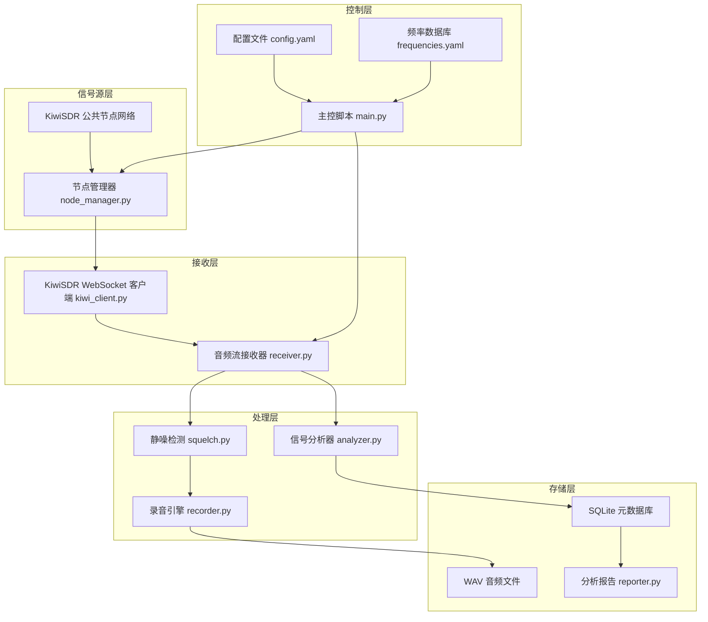

# 军事无线电信号接收与元数据分析系统

基于全球开源 KiwiSDR 节点网络，构建一套本地 Python 脚本系统，自动连接公共 SDR 接收器，监听已知军事 HF 频段，录制音频，并进行信号元数据分析与可视化。

> [!NOTE]
> 本项目仅用于合法的无线电监听爱好。接收公开广播的无线电信号在大多数国家/地区是合法的。我们只监听公开已知的军事频率，不涉及解密或任何非法行为。

## User Review Required

> [!IMPORTANT]
> **KiwiSDR 节点连接方式**：由于 KiwiSDR 没有官方公开的节点列表 API，我计划采取以下方案：
> 1. 内置一个精心整理的公共 KiwiSDR 节点列表（包含地理位置、频率范围等）
> 2. 提供用户手动添加/编辑节点的能力
> 3. 使用 WebSocket 直连 KiwiSDR 节点进行音频流接收
>
> 如果你有特定想监听的 KiwiSDR 节点或区域偏好，请告知。

> [!WARNING]
> **关于 `kiwiclient` 库**：标准方案是使用 `jks-prv/kiwiclient` 库（需要 `git clone`）。为了减少外部依赖、提高可控性，我计划**自行实现一个轻量级的 KiwiSDR WebSocket 客户端**，仅包含我们需要的功能（连接、调谐、音频接收）。这样代码完全自包含。

## Open Questions

1. **监听策略**：你希望同时监听多少个频率？建议初始支持 1-3 个并发连接（每个 KiwiSDR 节点通常限制 4-8 个并发用户）。
2. **录音时长**：持续录音还是仅在检测到信号活动时录制？建议采用后者（静噪检测 + 活动触发录制）以节省磁盘空间。
3. **分析深度**：
   - **基础**：信号强度、活动时间、频率统计
   - **中级**：频谱分析、信号调制类型识别
   - **高级**：信号模式识别、ALE 解码
   
   建议从基础+中级开始，你觉得呢？

## 系统架构



## Proposed Changes

### 项目根目录结构

```
无线电/
├── config.yaml              # 主配置文件
├── frequencies.yaml         # 军事频率数据库
├── requirements.txt         # Python 依赖
├── main.py                  # 主入口脚本
├── src/
│   ├── __init__.py
│   ├── kiwi_client.py       # KiwiSDR WebSocket 客户端
│   ├── node_manager.py      # SDR 节点发现与管理
│   ├── receiver.py          # 信号接收控制器
│   ├── squelch.py           # 静噪检测（VOX）
│   ├── recorder.py          # 音频录制
│   ├── analyzer.py          # 信号元数据分析
│   ├── db.py                # SQLite 数据库操作
│   └── reporter.py          # 分析报告生成
├── data/
│   ├── recordings/          # 录音文件目录
│   └── radio_monitor.db     # SQLite 数据库
└── reports/                 # 分析报告输出
```

---

### 配置系统

#### [NEW] [config.yaml](file:///c:/Users/xiexiaokai/Documents/无线电/config.yaml)
主配置文件，包含：
- KiwiSDR 节点列表（host, port, name, location, max_freq）
- 录音参数（采样率、格式、最大录音时长）
- 静噪阈值设置
- 数据库路径
- 并发连接数限制

#### [NEW] [frequencies.yaml](file:///c:/Users/xiexiaokai/Documents/无线电/frequencies.yaml)
军事 HF 频率数据库，包含：
- **HFGCS 主频**：4724, 6712, 6739, 8992, 11175, 13200, 15016 kHz
- **NATO STANAG**：常见 STANAG 4285/4481 频率
- **军用航空**：常见军事航空通信频率
- **ALE 网络**：已知 ALE 扫描频率
- 每个频率包含：频率值、调制模式(USB/AM)、描述、所属网络、活跃时段

---

### KiwiSDR 客户端

#### [NEW] [src/kiwi_client.py](file:///c:/Users/xiexiaokai/Documents/无线电/src/kiwi_client.py)
轻量级 KiwiSDR WebSocket 客户端：
- 使用 `websockets` 库建立 WebSocket 连接
- 实现 KiwiSDR 握手协议（SET auth, SET mod, SET gen 等命令）
- 接收并解析二进制音频数据帧
- 提供 `connect()`, `set_frequency()`, `set_mode()`, `get_audio_stream()` 等接口
- 支持 S-meter（信号强度）数据读取
- 自动重连机制

#### [NEW] [src/node_manager.py](file:///c:/Users/xiexiaokai/Documents/无线电/src/node_manager.py)
KiwiSDR 节点管理：
- 从 config.yaml 加载节点列表
- 节点可用性探测（尝试 WebSocket 握手）
- 按地理位置 / 频率范围 / 可用性排序
- 节点健康检查与故障转移

---

### 接收与录制

#### [NEW] [src/receiver.py](file:///c:/Users/xiexiaokai/Documents/无线电/src/receiver.py)
信号接收控制器：
- 管理多个并发 KiwiSDR 连接
- 根据配置的频率列表自动调谐
- 支持频率扫描模式（按列表轮询）和固定监听模式
- 协调音频流 → 静噪检测 → 录制器的数据管道
- 异步 I/O（asyncio）

#### [NEW] [src/squelch.py](file:///c:/Users/xiexiaokai/Documents/无线电/src/squelch.py)
静噪 / 信号活动检测：
- RMS 能量检测（基于 numpy）
- 可配置的开启/关闭阈值及延迟
- 信号活动事件回调
- 支持 S-meter 值辅助判断

#### [NEW] [src/recorder.py](file:///c:/Users/xiexiaokai/Documents/无线电/src/recorder.py)
音频录制引擎：
- 接收原始音频样本并写入 WAV 文件
- 文件命名格式：`{timestamp}_{freq_kHz}_{node_name}.wav`
- 自动分段（最长录音时长可配置）
- 录音前后留白（pre-roll buffer，防止截断信号开头）
- 录音元数据同步写入数据库

---

### 分析系统

#### [NEW] [src/analyzer.py](file:///c:/Users/xiexiaokai/Documents/无线电/src/analyzer.py)
信号元数据分析：
- **时域分析**：信号持续时间、能量包络
- **频域分析**：FFT 频谱、带宽估算
- **特征提取**：
  - 信号峰值功率
  - 信号带宽
  - 调制类型初步识别（通过频谱形状）
  - 信号 SNR 估算
- 使用 `numpy` + `scipy` 实现
- 分析结果存入 SQLite

#### [NEW] [src/db.py](file:///c:/Users/xiexiaokai/Documents/无线电/src/db.py)
SQLite 数据库管理：
- 表结构：
  - `sessions`：监听会话记录
  - `signals`：检测到的信号记录（时间、频率、持续时间、信号强度、节点、录音文件路径）
  - `analysis`：信号分析结果（频谱特征、调制类型、SNR 等）
  - `nodes`：节点状态与历史
- CRUD 操作封装
- 统计查询接口

#### [NEW] [src/reporter.py](file:///c:/Users/xiexiaokai/Documents/无线电/src/reporter.py)
分析报告生成：
- **频率活动热力图**：哪些频率在什么时间最活跃
- **信号统计图表**：使用 `matplotlib` 生成
  - 每日/每周活动时间线
  - 频率活跃度排名
  - 信号强度分布
  - 节点性能对比
- 输出 HTML 报告 + PNG 图表到 `reports/` 目录

---

### 主入口

#### [NEW] [main.py](file:///c:/Users/xiexiaokai/Documents/无线电/main.py)
命令行入口脚本：
- 子命令设计：
  - `python main.py monitor` — 启动监听（核心功能）
  - `python main.py scan` — 扫描所有配置频率，快速检测活动
  - `python main.py analyze [recording.wav]` — 对指定录音做后处理分析
  - `python main.py report` — 生成分析报告
  - `python main.py nodes` — 测试并列出可用 KiwiSDR 节点
- 使用 `argparse` 解析命令行参数
- 信号处理（Ctrl+C 优雅退出）

#### [NEW] [requirements.txt](file:///c:/Users/xiexiaokai/Documents/无线电/requirements.txt)
```
websockets>=12.0
numpy>=1.24
scipy>=1.10
matplotlib>=3.7
pyyaml>=6.0
aiohttp>=3.9
```

## Verification Plan

### Automated Tests
1. **节点连通性测试**：
   ```bash
   python main.py nodes
   ```
   验证至少能成功连接到 1-2 个公共 KiwiSDR 节点。

2. **短时录音测试**：
   ```bash
   python main.py monitor --duration 30
   ```
   运行 30 秒监听，验证：
   - WebSocket 连接建立成功
   - 音频数据流正常接收
   - WAV 文件正确写入
   - 数据库记录创建

3. **分析管道测试**：
   ```bash
   python main.py analyze data/recordings/test_recording.wav
   python main.py report
   ```
   验证分析和报告生成正常工作。

### Manual Verification
- 用音频播放器检查录制的 WAV 文件是否包含有效音频
- 检查生成的 HTML 报告和图表是否正确渲染
- 验证 SQLite 数据库中的记录是否完整
